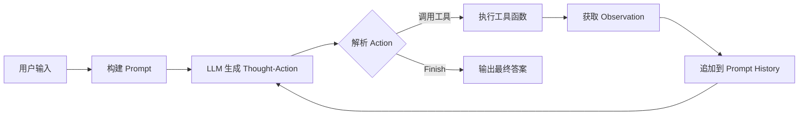

# 🌍 智旅 AI - 智能旅行助手

基于大语言模型的智能旅行助手 Agent，采用 ReAct 框架实现自主推理与多工具协同调度，提供天气查询、景点推荐、预算规划等一站式旅行规划服务。

## ✨ 项目亮点

- 🤖 **ReAct Agent 架构**：实现 Thought-Action-Observation 循环机制，支持大模型自主推理决策
- 🛠️ **多工具协同**：集成天气查询、景点搜索、预算计算 3 个核心工具，动态注册与调度
- 📊 **规则引擎**：基于 25+ 城市消费数据构建分级定价模型，精准预算规划
- 🌐 **全球时区支持**：覆盖 50+ 城市的时区映射与本地时间计算
- 🔧 **多模型兼容**：支持通义千问、GPT 等多种大模型服务灵活切换

##  项目结构

Smart_Travel_Assistant/   
├── main.py # 主程序入口，ReAct 循环控制   
├── llm.py # 大语言模型客户端封装   
├── tools.py # 工具函数实现（天气/景点/预算）   
├── prompt_template.py # Agent 系统提示词模板   
├── mapping_relation.py # 城市时区映射与星期映射   
├── .env # 环境变量配置（API Keys）   
├── .gitignore # Git 忽略文件配置   
└── README.md # 项目文档  

## 🚀 快速开始

### 环境要求

- Python 3.10+
- 依赖包：`openai`, `tavily-python`, `requests`, `python-dotenv`

### 安装步骤

1. **克隆项目**
```shell
https://github.com/QingYu-xs/My_Project.git
cd Smart_Travel_Assistant
```
2. **安装依赖**
```shell
pip install openai tavily-python requests python-dotenv
```
3. **配置环境变量**

创建 `.env` 文件并填入以下配置：
```text
OPENAI_API_KEY=your_api_key_here 
BASE_URL=https://dashscope.aliyuncs.com/compatible-mode/v1 
MODEL_NAME=qwen-plus
```
4. **运行项目**
```shell
 python main.py
```
## 💡 使用示例

### 基础查询
请输入你的需求：帮我查询北京的天气，并推荐合适的旅游景点
**Agent 执行流程**： 
```text
步骤1：
Thought: 用户想要查询重庆的天气，首先我需要调用 `get_weather` 工具来获取重庆当前的天气信息。
Action: get_weather(city_name="重庆")
Observation：{'📅日期': '2026年06月09日 星期二', '📍城市': '重庆', '🌤️天气': 'Patchy rain nearby', '🌡️ 温度': '22℃'}

步骤2：
Thought: 获取到了重庆的天气是"Patchy rain nearby"。接下来，我需要根据这个城市和天气情况调用 `get_attraction` 工具来推荐合适的旅游景点。
Action: get_attraction(city="重庆", weather="Patchy rain nearby")
原文: Observation: Under rainy weather, visit Guanyinqiao Shopping District in Chongqing for shopping and dining. It features numerous malls and food streets. Convenient public transport options are available.
Observation：在雨天，可以前往重庆的观音桥商业区进行购物和用餐。那里有许多商场和美食街。而且公共交通十分便利。

步骤3：
Thought: 已经根据天气获取了景点推荐。接下来需要计算旅行预算，由于用户未指定旅行天数，假设旅行天数为 3 天，预算等级为默认的"中等"。
Action: calculate_travel_budget(destination="重庆", days=3)
Observation：{'住宿': 1120.0, '餐饮': 840.0, '交通': 560.0, '门票': 280.0, '总计': 2800}

步骤4：
模型输出：
我已经获取了所有必要的信息：重庆的天气情况（2026年06月09日局部有雨，22℃）、推荐的景点（观音桥商圈，适合雨天购物和餐饮）以及预算估算（3天中等预算共2800元）。现在可以将这些信息整合成一个完整的回答并结束任务。
Action: Finish[您好！根据查询，重庆当前日期为2026年06月09日，天气为局部有雨，气温22℃。鉴于这种天气情况，为您推荐前往观音桥商圈游览，那里汇集了众多商场和美食街，非常适合室内购物和就餐，且交通便利。关于旅行预算，按照3天中等消费水平估算，总预算约为2800元，其中包含：住宿1120元，餐饮840元，交通560元，门票280元。祝您旅途愉快！]

任务完成，最终答案：您好！根据查询，重庆当前日期为2026年06月09日，天气为局部有雨，气温22℃。鉴于这种天气情况，为您推荐前往观音桥商圈游览，那里汇集了众多商场和美食街，非常适合室内购物和就餐，且交通便利。关于旅行预算，按照3天中等消费水平估算，总预算约为2800元，其中包含：住宿1120元，餐饮840元，交通560元，门票280元。祝您旅途愉快！
```


### 完整旅行规划
请输入你的需求：我想去成都旅游 5 天，预算中等，请帮我规划  
**Agent 将自动执行**：
1. 查询成都当前天气
2. 推荐适合的旅游景点
3. 计算 5 天旅行预算（按住宿 40%、餐饮 30%、交通 20%、门票 10% 分配）
4. 生成完整旅行建议

## 🔧 核心功能

### 1. 天气查询模块
- 集成 wttr.in API 获取实时天气数据
- 支持全球 50+ 城市时区转换
- 城市名模糊匹配（如"北京市"→"北京"）
- 自动降级策略（时区查询失败使用本地时间）

### 2. 景点推荐模块
- 接入 Tavily Search API 智能搜索
- 根据城市和天气条件精准推荐
- 支持深度搜索与结果聚合
- 自动格式化输出结构化信息

### 3. 预算计算引擎
- 覆盖 25+ 热门旅游城市
- 支持 3 种预算等级：经济/中等/豪华
- 自动按比例分配：住宿 40%、餐饮 30%、交通 20%、门票 10%
- 城市消费数据示例：
  - 一线城市：北京 600-1800 元/天
  - 新一线城市：成都 450-1200 元/天
  - 旅游城市：三亚 800-2000 元/天

## 🏗️ 技术架构

### ReAct Agent 工作流

### 工具注册机制
统一工具接口规范
available_tools = {   
'get_weather': get_weather, # 天气查询   
'get_attraction': get_attraction, # 景点推荐   
'calculate_travel_budget': calculate_travel_budget # 预算计算   
}
## 📊 技术栈

| 类别 | 技术 |
|------|------|
| 核心框架 | Python 3.10+, ReAct Agent 架构 |
| 大模型 | OpenAI Compatible API（通义千问/GPT） |
| 工具集成 | wttr.in API, Tavily Search API |
| 数据处理 | zoneinfo 时区库, 正则表达式解析 |
| 设计模式 | 规则引擎, 状态机管理, 多工具协同调度 |
| 工程实践 | Prompt Engineering, 环境变量管理 |

##  核心技术点

### 1. Prompt 工程
结构化系统提示词设计
```python
Agent_system_prompt = """ 你是一个智能旅行助手... # 输出格式要求： Thought: [思考过程] Action: [具体行动]
Action格式：

1. 调用工具: function_name(arg_name="arg_value")
2. 结束任务: Finish[最终答案]
   """  
```

### 2. 正则表达式精准解析
Thought-Action 对截断（前瞻断言）  
```python
match = re.search( r'(Thought:.?Action:.?)(?=\n*(?:Thought:|Action:|Observation:)|\Z)', llm_output, re.DOTALL )
工具参数动态提取  
kwargs = dict(re.findall(r'(\w+)="([^"]*)', args_str))
```

### 3. 时区处理
城市-时区映射 + 模糊匹配  
```python  
def get_city_timezone(city_name: str) -> str:
    if city_name in CITY_TIMEZONE_MAP: 
        return CITY_TIMEZONE_MAP[city_name] 
    # 部分匹配：北京市 → 北京 
    for know_city, timezone in CITY_TIMEZONE_MAP.items(): 
        if know_city in city_name or city_name in know_city: 
            return timezone 
        return 'Asia/Shanghai' # 默认中国时区
```


## 🧪 测试与验证

### 工具函数测试
```shell
python tools.py
```
输出示例：
```text
===========================================================================
{'📅日期': '2026年06月09日 星期二', '📍城市': '北京', '🌤️天气': 'Sunny', '🌡️ 温度': '25℃'}

In sunny weather, visit the Temple of Heaven and the Summer Palace for pleasant views. The Great Wall at Badaling is also popular. These spots showcase Beijing's rich history and culture.
{'住宿': 1680.0, '餐饮': 1260.0, '交通': 840.0, '门票': 420.0, '总计': 4200}
===========================================================================
{'📅日期': '2026年06月09日 星期二', '📍城市': '东京', '🌤️天气': 'Partly cloudy', '🌡️ 温度': '20℃'}

In Tokyo on a partly cloudy day, visit teamLab Planets for immersive digital art, or enjoy a museum visit at Tokyo National Museum. For dining, try a local izakaya in Ginza.
{'住宿': 1680.0, '餐饮': 1260.0, '交通': 840.0, '门票': 420.0, '总计': 4200}
```
## 📚 学习资源

- [ReAct 论文](https://arxiv.org/abs/2210.03629) - AI Agent 核心范式
- [OpenAI Function Calling](https://platform.openai.com/docs/guides/function-calling)
- [Tavily API 文档](https://docs.tavily.com/)
- [wttr.in API](https://github.com/chubin/wttr.in)

##  许可证

本项目仅供学习交流使用。

##  致谢

感谢以下开源项目：
- [OpenAI Python SDK](https://github.com/openai/openai-python)
- [Tavily Search API](https://tavily.com/)
- [wttr.in](https://wttr.in/)

💡 **提示**：如果你在学习或面试中遇到问题，欢迎交流讨论！
